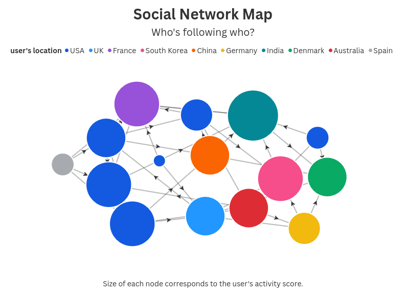
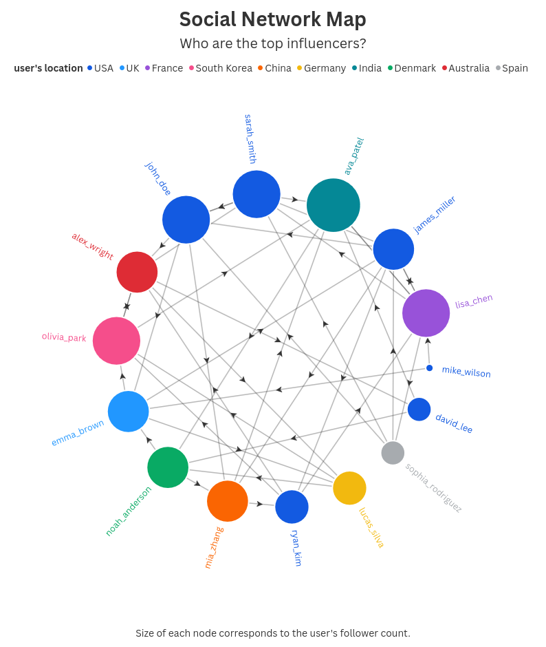

```bash
sudo mongod --dbpath backend/data     # start MongoDB server
npm start --prefix backend            # start backend server
npm start --prefix frontend           # start frontend server
node backend/scripts/seedDatabase.js  # populate db with initial data
mongosh 						  	  # start MongoDB shell
```

MongoDB shell executes commands written in JavaScript, with MongoDB-specific extensions.

In MongoDB shell:

```
show dbs	# list all non-empty databases in the Mongodb instance
	# returns:
        admin   40.00 KiB
        config  12.00 KiB
        local   72.00 KiB
        pinterest-clone  40.00 KiB

use pinterest-clone					# select project database

show collections					# list collections in db
	# returns:
        boards
        comments
        pins
        users
```

# Exploring collections in the database

`db.[collection].findOne()` returns a data point from the specified collection.

`db.[collection].countDocuments()` returns the number/count of data points in the collection.

`db.[collection].stats()` returns info about the collection.

### boards

_id: ObjectId('6818f293a7dee90fc31b0d92'),
**title**: 'Urban Photography',
**description**: 'Capturing city life and architecture',
**user**: ObjectId('6818f28fa7dee90fc31b0d73'),
**pins**: [],
**createdAt**: ISODate('2025-05-05T17:17:07.058Z'),
__v: 0

**Count:** 14

### comments

  _id: ObjectId('6818f293a7dee90fc31b0db0'),
  **text**: 'This is exactly what I was looking for! Thanks for sharing.',
  **user**: ObjectId('6818f28fa7dee90fc31b0d71'),
  **pin**: ObjectId('6818f293a7dee90fc31b0dae'),
  **createdAt**: ISODate('2025-05-04T02:33:19.273Z'),
  __v: 0

**Count**: 171

### pins (posts)

 _id: ObjectId('6818f293a7dee90fc31b0dae'),
  **title**: 'Beautiful Sunset in Bali',
  **description**: 'Captured this amazing sunset during my trip to Bali. The colors were absolutely stunning!',
  **imageUrl**: 'https://source.unsplash.com/800x600/?sunset,bali',
  **category**: 'Travel',
  **tags**: [ 'travel', 'sunset', 'bali' ],
  **board**: null,
  **user**: ObjectId('6818f28fa7dee90fc31b0d66'),
  **comments**: [],
  **views**: 956,
  **saves**: 93,
  **clicks**: 288,
  **viewDuration**: 806,
  **deviceTypes**: { mobile: 502, tablet: 368, desktop: 86 },
  **locations**: { CN: 948, UK: 1, DK: 6, US: 1 },
  **createdAt**: ISODate('2025-05-05T17:17:07.114Z'),
  **updatedAt**: ISODate('2025-05-05T17:17:07.116Z'),
  __v: 0

**Count**: 65

### users

_id: ObjectId('6818f28fa7dee90fc31b0d66'),
  **username**: 'mike_wilson',
  **email**: 'mike@example.com',
  **password**: '$2a$10$a.MaupagMd/zsaqT/sWTXeh3Ddf69jAIB4x3/Q6UeVhJbeeWMVup6',
  **bio**: 'Food lover and amateur chef. Cooking and sharing recipes.',
  **avatar**: 'https://i.pravatar.cc/150?img=3',
  **location**: 'Chicago, USA',
  **website**: 'https://mikeskitchen.com',
  **followers**: [],
  **following**: [
    ObjectId('6818f28fa7dee90fc31b0d67'),
    ObjectId('6818f28fa7dee90fc31b0d69')
  ],
  **interests**: [],
  **segment**: 'casual',
  **activityScore**: 0,
  **lastLogin**: ISODate('2025-04-08T13:28:12.756Z'),
  **loginCount**: 21,
  **deviceType**: 'desktop',
  **deviceTypes**: { mobile: 8, desktop: 7, tablet: 6 },
  **locations**: { FR: 7, US: 13, IN: 1 },
  **sessionDuration**: 108,
  **totalPinsCreated**: 0,
  **totalComments**: 0,
  **totalBoards**: 0,
  **createdAt**: ISODate('2025-05-05T17:17:03.298Z'),
  **updatedAt**: ISODate('2025-05-05T17:17:06.990Z'),
  __v: 1

**Count**: 15


# Find duplicate or anomalous records

| Expected time: 2 | Actual time: 4 |
| ---------------- | -------------- |

`db.[collection].aggregate()` is used to build and execute a data processing pipeline. Each step is called a "stage"

**$match**: Filters the data based on conditions, like WHERE in SQL.

**$group**: Groups documents by a specified field and performs operations on the grouped data, like GROUP BY in SQL.

**$sort**: Sorts the documents by a specified field

**$limit**: Limits the number of documents in the result

**$lookup**: Performs a left outer join between two collections


*<u>Duplicate users</u>*: None

```javascript
// There are no two users with the same email. 
pinterest-clone> db.users.aggregate([
  {$group: {_id: "$email", count: {$sum: 1}}},
  {$match: {count: {$gt: 1}}}
])

// There are no two users with the same username. 
pinterest-clone> db.users.aggregate([
  {$group: {_id: "$username", count: {$sum: 1}}},
  {$match: {count: {$gt: 1}}}
])

// There are no two users with the same website. 
pinterest-clone> db.users.aggregate([
  {$group: {_id: "$website", count: {$sum: 1}}},
  {$match: {count: {$gt: 1}}}
])
```

*<u>Pins with impossible stats</u>*: There are 5 pins with more saves than views.

```javascript
pinterest-clone> db.pins.find({
...   $expr: {$gt: ["$saves", "$views"]}
... })
[
  {
    _id: ObjectId('6818f293a7dee90fc31b0de0'),
    title: 'Knife Skills 101',
    description: 'Essential knife techniques every home chef should know. Includes proper grip, basic cuts, and safety tips.',
    imageUrl: 'https://source.unsplash.com/800x600/?knife,cooking',
    category: 'Food',
    tags: [ 'cooking', 'techniques', 'kitchen' ],
    board: null,
    user: ObjectId('6818f28fa7dee90fc31b0d72'),
    comments: [],
    views: 180,
    saves: 186,
    clicks: 74,
    viewDuration: 3417,
    deviceTypes: { mobile: 108, tablet: 48, desktop: 24 },
    locations: { AU: 141, UK: 29, IN: 8, US: 1, DK: 1 },
    createdAt: ISODate('2025-05-05T17:17:07.242Z'),
    updatedAt: ISODate('2025-05-05T17:17:07.244Z'),
    __v: 0
  },
  {
    _id: ObjectId('6818f294a7dee90fc31b0ef0'),
    title: 'Herb Garden Guide',
    description: 'Create and maintain a kitchen herb garden. Includes plant selection and care tips.',
    imageUrl: 'https://source.unsplash.com/800x600/?herbs,garden',
    category: 'Gardening',
    tags: [ 'herbs', 'garden', 'cooking' ],
    board: null,
    user: ObjectId('6818f28fa7dee90fc31b0d6a'),
    comments: [],
    views: 60,
    saves: 147,
    clicks: 47,
    viewDuration: 4093,
    deviceTypes: { mobile: 25, tablet: 21, desktop: 14 },
    locations: { AU: 46, UK: 5, ES: 6, DK: 2, DE: 1 },
    createdAt: ISODate('2025-05-05T17:17:08.156Z'),
    updatedAt: ISODate('2025-05-05T17:17:08.157Z'),
    __v: 0
  },
  {
    _id: ObjectId('6818f294a7dee90fc31b0f00'),
    title: 'Electric Vehicle Guide',
    description: 'Complete guide to electric vehicles. Charging, maintenance, and cost comparison.',
    imageUrl: 'https://source.unsplash.com/800x600/?electric-car,automotive',
    category: 'Automotive',
    tags: [ 'ev', 'automotive', 'sustainable' ],
    board: null,
    user: ObjectId('6818f28fa7dee90fc31b0d6b'),
    comments: [],
    views: 60,
    saves: 101,
    clicks: 146,
    viewDuration: 2568,
    deviceTypes: { mobile: 18, tablet: 23, desktop: 19 },
    locations: { KR: 37, US: 9, FR: 8, UK: 4, ES: 2 },
    createdAt: ISODate('2025-05-05T17:17:08.198Z'),
    updatedAt: ISODate('2025-05-05T17:17:08.199Z'),
    __v: 0
  },
  {
    _id: ObjectId('6818f294a7dee90fc31b0f3c'),
    title: 'Music Production Guide',
    description: "Beginner's guide to music production. DAW setup, plugins, and basic techniques.",
    imageUrl: 'https://source.unsplash.com/800x600/?music-production,studio',
    category: 'Music',
    tags: [ 'music', 'production', 'studio' ],
    board: null,
    user: ObjectId('6818f28fa7dee90fc31b0d6e'),
    comments: [],
    views: 58,
    saves: 185,
    clicks: 106,
    viewDuration: 4968,
    deviceTypes: { mobile: 6, tablet: 18, desktop: 34 },
    locations: { KR: 6, AU: 11, IN: 5, ES: 24, UK: 11, FR: 1 },
    createdAt: ISODate('2025-05-05T17:17:08.353Z'),
    updatedAt: ISODate('2025-05-05T17:17:08.354Z'),
    __v: 0
  },
  {
    _id: ObjectId('6818f294a7dee90fc31b0f54'),
    title: 'Green Building Design',
    description: 'Sustainable building design principles. Materials, energy efficiency, and certifications.',
    imageUrl: 'https://source.unsplash.com/800x600/?green-building,architecture',
    category: 'Architecture',
    tags: [ 'green building', 'architecture', 'sustainable' ],
    board: null,
    user: ObjectId('6818f28fa7dee90fc31b0d6f'),
    comments: [],
    views: 24,
    saves: 62,
    clicks: 98,
    viewDuration: 977,
    deviceTypes: { mobile: 20, tablet: 3, desktop: 1 },
    locations: { FR: 22, CN: 1, IN: 1 },
    createdAt: ISODate('2025-05-05T17:17:08.412Z'),
    updatedAt: ISODate('2025-05-05T17:17:08.413Z'),
    __v: 0
  }
]
```

# Map the social network

| Expected time: 4 | Actual time: 2 |
| ---------------- | -------------- |

Data processing done using Pandas at pinterest-clone/_data_analysis/map_social_network/graph_network.py.

Network graph made in Flourish. 

<div align="center">  </div>

# Identify top creators and influencers

| Expected time: 4 | Actual time: 2 |
| ---------------- | -------------- |

Radial network graph made in Flourish. 

<div align="center">  </div>

# Create dashboards for weekly reporting

Expected time: 2

Actual:
